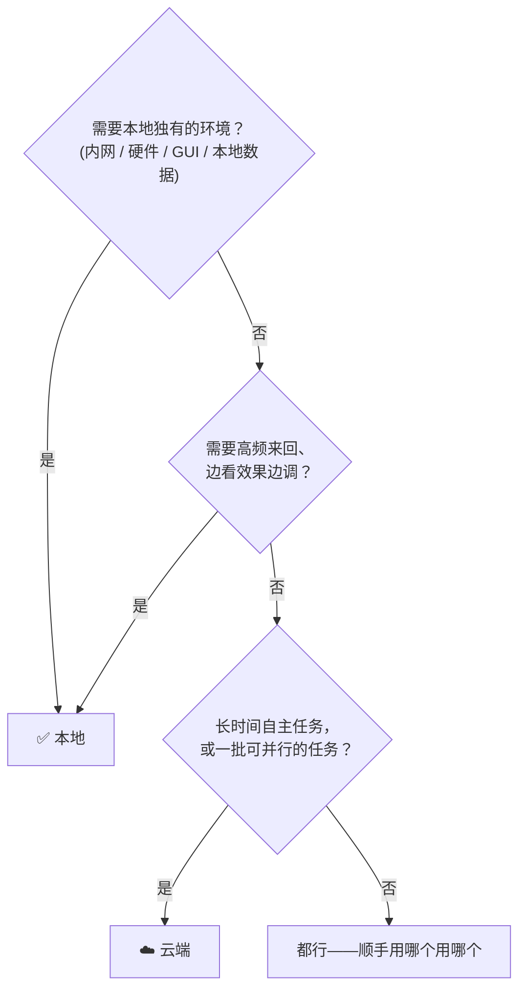

# 哪些任务适合云端跑，哪些适合本地跑？—— Claude Code 云端 / 本地选型分析

> 同一个 Claude Code，既能在你电脑的终端里跑（本地 CLI），也能在云端沙箱里跑（Claude Code on the web / 移动端发起的远程会话）。
> 这篇文档帮你回答一个高频问题：**手上的任务或项目，到底放云端合适，还是放本地合适？**

本文采用 [CC BY 4.0](../LICENSE) 许可，自由转载，注明出处即可。

---

## 目录

- [1. 先分清：本地和云端各是什么](#1-先分清本地和云端各是什么)
- [2. 五个判断维度](#2-五个判断维度)
- [3. 适合放云端的任务](#3-适合放云端的任务)
- [4. 适合放本地的任务](#4-适合放本地的任务)
- [5. 一张决策速查表](#5-一张决策速查表)
- [6. 按角色看：产品 / 研发 / 交付 / 运营](#6-按角色看产品--研发--交付--运营)
- [7. 混合用法：本地为主、云端打杂](#7-混合用法本地为主云端打杂)
- [8. 安全边界提醒](#8-安全边界提醒)

---

## 1. 先分清：本地和云端各是什么

| | 本地 CLI | 云端（Claude Code on the web） |
| --- | --- | --- |
| **跑在哪** | 你自己的电脑终端里 | 云上的隔离沙箱容器里 |
| **代码从哪来** | 直接读写你磁盘上的项目目录 | 会话开始时从 GitHub 克隆一份 |
| **能碰到什么** | 你机器上的一切：本地文件、内网、已登录的工具、硬件 | 容器里的东西 + 受网络策略约束的外网；碰不到你的电脑和内网 |
| **交互方式** | 终端对话，改完立刻在本地看效果 | 网页 / 手机上发任务，做完以分支或 PR 的形式交付 |
| **生命周期** | 你开着它就在 | 容器是临时的，会话闲置后回收；**成果必须 commit + push 才保得住** |
| **并行能力** | 一般一次盯一个（多开窗口也行，但都占你机器资源） | 可以同时开好几个会话，互不干扰，不占你机器一点资源 |

一句话总结：

> **本地 = Agent 坐在你旁边结对；云端 = 把任务外包给一个远程同事，做完给你交一个 PR。**

选型的本质就是判断：这个任务更需要"坐在你旁边"，还是更适合"外包出去"。

---

## 2. 五个判断维度

拿到一个任务，依次问自己五个问题：

1. **环境依赖**：任务需要碰你本地才有的东西吗？（内网服务、本地数据库、硬件设备、GUI / 模拟器、已配好的复杂环境）
   → 需要，就只能本地。
2. **交互密度**：你是要跟它高频来回讨论、边看效果边调，还是说清楚需求后就可以放手不管？
   → 高频来回 → 本地；说完放手 → 云端。
3. **任务时长**：几分钟能完的小事，还是要自主跑半小时以上的长活？
   → 长活挂云端最舒服，不占你的电脑，你该干嘛干嘛。
4. **并行需求**：是一个任务，还是一批相互独立的任务？
   → 一批独立任务 → 云端多开会话并行，效率翻倍。
5. **敏感程度**：涉及公司内部资产、私有凭据、不能出内网的数据吗？
   → 内部资产遵守你所在组织的规定；不确定就先问清楚（见第 8 章）。

前两个维度是硬约束（决定"能不能"），后三个是效率取舍（决定"哪个更划算"）。

---

## 3. 适合放云端的任务

共同特征：**需求能一次说清、不依赖你本地的环境、做完以 commit / PR 交付**。

### ✅ 长时间自主任务

- 大范围重构、批量重命名、依赖升级并修复所有报错；
- 全仓库代码审查、安全审查、补测试；
- "把这个 issue 修了，测试跑绿再开 PR"。

这类活跑起来动辄十几分钟到几小时。放本地你得开着电脑干等；放云端你发完任务就可以合上电脑，回头看 PR。

### ✅ 一批相互独立的小任务

- 十个仓库各改一处配置；
- 一批文档的批量校对 / 翻译 / 格式统一；
- 多个互不相关的小 bug。

云端可以**同时开多个会话并行处理**，每个会话独立沙箱互不污染，这是本地单终端做不到的。

### ✅ 随时随地发起的碎片任务

- 通勤路上想起一个 typo，手机上发个任务让它修掉；
- 开会时评审人提了个小改动，直接从网页发给云端会话去改。

不需要"回到电脑前"这个前置条件，是云端独有的优势。

### ✅ 盯 PR / 盯 CI 这类"值守"任务

- "盯着这个 PR，CI 挂了就修，评审意见来了就改"；
- 定时任务：每天汇总仓库变更、定期跑检查。

值守任务的本质是**等待 + 偶发响应**，让云端会话挂着等事件，比占用你本地一个终端窗口划算得多。

### ✅ 环境干净反而是优点的任务

- 验证"新人克隆下来能不能跑通"（云端每次都是全新克隆，天然模拟新人视角）；
- 不想让实验性改动弄脏本地工作区的尝试性重构——云端沙箱怎么折腾都不影响你本地。

---

## 4. 适合放本地的任务

共同特征：**依赖只有你机器上才有的东西，或需要你人在旁边高频参与**。

### 🖥️ 依赖本地环境的任务（硬约束，没得选）

- 要连**内网 / VPN 内**的服务、数据库、自建 GitLab；
- 要操作**本地硬件**：手机真机调试、嵌入式设备、打印机；
- 要跑 **GUI 应用、iOS/Android 模拟器**、本地 Docker 编排起来的整套服务；
- 依赖机器上**已经配好、难以复制**的环境（特殊工具链、许可证软件、本地大数据集）。

云端沙箱碰不到你的电脑和内网，这类任务只能本地。

### 🤝 高频交互、边做边看的任务

- 前端 / UI 开发：改一行样式就想立刻在浏览器里看效果；
- 探索式调试：你和 Agent 一起"下个断点看看 → 不对，再看那个变量"地来回；
- 需求还没想清楚，需要边讨论边成形的方案设计。

这类任务的瓶颈在**你和它的对话回合数**，坐在旁边（本地）来回最快。

### 📂 还没托管到 GitHub 的项目

云端会话从 GitHub 克隆代码。散落在本地、还没建远程仓库的文件夹，自然只能本地处理——或者干脆让本地 Agent 先帮你把它推上 GitHub（参见[上一篇教程](using-git-with-ai-agents.md)），之后就云端本地随便选了。

### 🔐 受限于合规 / 内网红线的内容

公司内部代码和文档如果规定不出内网，那就只能在内网环境里处理。详见第 8 章。

---

## 5. 一张决策速查表

| 任务 / 项目类型 | 推荐 | 为什么 |
| --- | --- | --- |
| 修一个描述清晰的 bug / issue | ☁️ 云端 | 说清即可放手，产出就是 PR |
| 大重构、依赖升级、全仓补测试 | ☁️ 云端 | 时间长，不占本机，跑完看结果 |
| 一批独立小任务（多仓改配置、批量校对文档） | ☁️ 云端 | 多会话并行 |
| 盯 PR、修 CI、定时巡检 | ☁️ 云端 | 值守型任务，挂着等事件 |
| 手机 / 网页上随手发起的小修改 | ☁️ 云端 | 不用回电脑前 |
| 公开仓库的文档写作、内容维护（比如本仓库） | ☁️ / 🖥️ 都行 | 无本地依赖；顺手用哪个用哪个 |
| 前端页面边改边看、UI 细调 | 🖥️ 本地 | 高频交互，本地看效果最快 |
| 探索式调试、边聊边定的方案设计 | 🖥️ 本地 | 对话回合密集 |
| 要连内网服务 / 本地数据库 / VPN | 🖥️ 本地 | 云端碰不到 |
| 真机 / 模拟器 / 硬件相关 | 🖥️ 本地 | 云端没有硬件 |
| 还没推上 GitHub 的本地项目 | 🖥️ 本地 | 云端无从克隆 |
| 公司内部资产（内网红线内） | 🖥️ 内网环境 | 合规优先，见第 8 章 |

---

## 6. 按角色看：产品 / 研发 / 交付 / 运营

接着[上一篇](using-git-with-ai-agents.md)的四个角色，看各自的任务怎么分：

### 🧩 产品

- ☁️ **云端**："把这三份 PRD 的术语统一成新版叫法，改完开 PR。"——批量、说清即走。
- 🖥️ **本地**：和 Agent 边讨论边写新方案初稿——需求在对话中成形，回合密集。

### 💻 研发

- ☁️ **云端**："修掉 issue #42，跑绿测试，开 PR"；"把依赖升到新大版本，编译错误都处理掉"；"盯着我这个 PR，CI 挂了就修。"
- 🖥️ **本地**：联调内网服务、复现只在本机出现的诡异 bug、改一行看一眼的 UI 开发。

### 📦 交付

- ☁️ **云端**：托管在 GitHub 上的交付文档批量更新版本号、统一格式。
- 🖥️ **本地**（多半是内网）：客户环境配置、涉及内部系统的交付物——跟着资产走，资产在内网就在内网做。

### 📣 运营

- ☁️ **云端**："这批活动 SOP 文档全部按新模板重排，开 PR 给大家评审。"手机上就能发起。
- 🖥️ **本地**：整理还没入库的本地素材文件夹，顺便让 Agent 建仓推上去。

---

## 7. 混合用法：本地为主、云端打杂

实际用得最顺手的往往不是二选一，而是**组合拳**：

1. **你在本地做主线**（高交互的核心开发），**把旁支杂活抛给云端**：补测试、修 lint、更新文档、处理另一个仓库的小 issue——等你主线告一段落，杂活的 PR 已经在等你评审了。
2. **云端做完，本地收尾**：云端会话产出 PR 后，如果最后需要真机验证或内网联调，拉到本地跑最后一步。
3. **本地起步，云端接力**：本地把还没入库的项目建仓推上 GitHub，之后的长任务就都能丢云端了。

判断口诀：

> **要"人在场"的留本地，能"说清放手"的丢云端；一批活就云端并行，长活挂云端过夜。**

---

## 8. 安全边界提醒

- **云端容器是临时的**：会话闲置后容器会被回收。凡是想留下的成果，务必让 Agent **commit 并 push** 到远程分支——"没推送 = 没发生"。
- **内部资产红线不变**：上一篇教程第 6 章那条红线在云端同样适用——**公司内部的代码和文档只进公司内部的 Git 平台**。云端会话克隆的是 GitHub 上的仓库，所以"能不能放云端"首先取决于"这份资产能不能放 GitHub"；不确定就先停下来问清楚。
- **敏感信息一个都别提交**：token、密码、私钥、客户数据，本地云端一视同仁。提交前让 Agent 自查一遍 diff。
- **云端的网络访问受策略约束**：会话能访问哪些外网由环境的网络策略决定，任务如果依赖某个外部服务，先确认策略放行了它。

---

> 顺带一提：**这篇文档本身就是在云端会话里写出来、以分支形式推送到这个仓库的**——它正好属于第 5 章速查表里"公开仓库的文档写作 → 云端合适"那一行。

📄 本文采用 [CC BY 4.0](../LICENSE) 许可，自由转载，注明出处即可。
