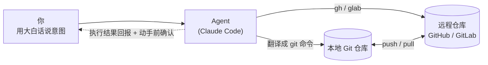

# 如何用类似 Claude Code 这种 Agent 来使用 Git

> 一份写给所有人的实战指南：你用大白话说"我想干什么"，Agent 帮你把 Git 命令跑对。
> 产品、研发、交付、运营——只要你需要管理文档或代码的版本，这篇都能帮到你。

<sub>本文采用 [CC BY 4.0](../LICENSE) 许可，自由转载，注明出处即可。</sub>

---

## 目录

- [0. 写在前面](#0-写在前面)
- [1. 先建立认知：Agent 和 Git 怎么配合](#1-先建立认知agent-和-git-怎么配合)
- [2. 环境准备与安装](#2-环境准备与安装)
- [3. CLI 怎么用：从 0 到第一次提交](#3-cli-怎么用从-0-到第一次提交)
- [4. 实战一：用 Agent 从零建一个仓库并分享](#4-实战一用-agent-从零建一个仓库并分享)
- [5. 实战二：产研交付运营的日常 Git 工作流](#5-实战二产研交付运营的日常-git-工作流)
- [6. 安全与边界](#6-安全与边界)
- [7. "说人话"对照表](#7-说人话对照表)
- [8. 上手清单 & 下一步](#8-上手清单--下一步)
- [附录 A：FAQ](#附录-afaq)
- [附录 B：名词小词典](#附录-b名词小词典)

---

## 0. 写在前面

很多人一听到 **Git** 就头疼，常见的几道坎是：

- **命令记不住**：`git rebase`、`git reset --hard`、`git cherry-pick`……名字像咒语，参数像天书。
- **不敢解冲突**：屏幕上突然冒出一堆 `<<<<<<<` `=======` `>>>>>>>`，不知道该删哪行。
- **怕搞坏仓库**：生怕一个手抖把同事一周的成果弄没了，于是干脆不碰，文件靠"方案_最终版_v3_真的最终.docx"来管理版本。

好消息是：**现在有了新范式。** 你不再需要先背命令再干活，而是反过来——

> **你用大白话描述"我想达成什么"，AI Agent（比如 Claude Code）帮你把正确的 Git 命令翻译出来、跑对、并把结果讲给你听。**

你负责"说清意图"，Agent 负责"翻译执行"。命令记不记得住，不再是门槛。

**谁该读这篇？**

| 角色 | 你能用它做什么 |
| --- | --- |
| 产品 | 给 PRD / 方案做版本留痕，多版迭代随时回看演进 |
| 研发 | 改完代码让它跑测试、提交、开 PR，还能解释历史改动 |
| 交付 | 把交付文档、配置纳入版本管理，每次变更可追溯 |
| 运营 | 用 PR 评审代替来回发文件附件，团队协作不丢版本 |

一句话：**凡是需要管理文档或代码版本的人，都能上手。** 不需要你是程序员。

---

## 1. 先建立认知：Agent 和 Git 怎么配合

先别急着敲命令，我们用一分钟把"协作模型"看明白。它其实很简单，就是一条流水线：

```
你（说意图） →  Agent（翻译成命令、执行） →  Git（本地仓库） →  远程仓库（GitHub / GitLab）
                      ↑  执行结果回报给你，动手前先征求确认  ↑
```

关键点有三个：

1. **你给的是"意图"，不是命令。** 你说"帮我把今天改的这份方案存成一个版本，写清楚改了什么"，而不是 `git add -A && git commit -m "..."`。
2. **Agent 是翻译官 + 执行者。** 它把你的话翻译成具体的 Git 命令，必要时调用 `gh`（GitHub）或 `glab`（GitLab）跟远程仓库打交道。
3. **动手前先确认，动手后会回报。** 涉及写文件、跑命令、推送等操作，Agent 会先把"我打算干什么"摆给你看，等你点头再做；做完会告诉你结果。这是安全护栏，下文第 6 章会专门讲。

这套模型对**非纯研发角色特别友好**：你不需要记住任何 Git 命令，只需要会描述目标。下面这张流程图把整条链路画了出来（在 GitHub 上会自动渲染成图）：



> **进阶：为什么要本地 + 远程两层？**
> Git 是"分布式"的：你电脑上有一份完整仓库（本地），团队共享的那份在服务器上（远程，比如 GitHub）。你平时的提交（commit）都先落在本地，等你愿意分享时再 `push` 到远程；别人的更新你用 `pull` 拉回来。Agent 会自动帮你判断什么时候该 push / pull，你只管说"分享出去"或"拉一下最新"。

---

## 2. 环境准备与安装

整个准备工作分两块：装 **Claude Code**（你的 Agent），以及装好 **Git 和远程平台工具**。一次配好，长期受用。

### 2.1 安装 Claude Code

**前置条件：** 需要 **Node.js 18 或更高版本**（建议安装较新的 LTS 版本或更高）。没装过 Node.js 的话，去 [nodejs.org](https://nodejs.org) 下载安装即可。检查是否已安装：

```bash
node --version
```

**安装命令：**

```bash
npm install -g @anthropic-ai/claude-code
```

> 建议**不要用 `sudo` 做全局安装**。直接 `sudo npm install -g ...` 看似省事，但容易把目录权限弄乱，后患无穷。
>
> <details><summary>进阶：遇到权限报错怎么办</summary>
>
> 如果不加 `sudo` 就报权限错误，推荐做法是把 npm 的全局安装目录配置到你的用户主目录下（这样就不需要管理员权限），再重新执行安装命令即可。具体配置方式以你系统上 npm 的官方指引为准。
> </details>

**启动：** 进入你的项目目录，运行：

```bash
cd /path/to/your-project
claude
```

**首次运行**会引导你登录——可以用 Anthropic 账号的订阅，或配置 API key。**具体登录选项以运行时的提示为准**，跟着屏幕走就行。

**验证安装 & 自检环境：**

```bash
claude --version   # 看版本号，能打印出来就说明装好了
claude doctor      # 自检运行环境，提示哪里有问题
```

> 凡是你拿不准的细节（某个登录选项、某个参数到底怎么写），**以官方文档或运行时 `/help` 的提示为准**就好，不用死记。

### 2.2 Git 与远程平台准备

**第一步，装好 Git 并配置身份**（这样每次提交才知道是谁做的）：

```bash
git --version  # 确认已安装；macOS / Linux 一般自带，Windows 去 git-scm.com 下载

git config --global user.name  "Your Name"
git config --global user.email "you@example.com"
```

**第二步，根据你用哪个远程平台，装对应的命令行工具：**

| 平台 | CLI 工具 | 登录方式 | 适合谁 |
| --- | --- | --- | --- |
| **GitHub**（对外公开协作） | `gh` | `gh auth login` | 开源、对外分享 |
| **GitLab**（很多公司自建在内网） | `glab` | 登录时指定自家实例地址 | 公司内部代码 / 文档 |

对外用 GitHub，登录一条命令搞定：

```bash
gh auth login   # 跟着交互提示走，选浏览器登录最省事
```

公司内部如果用**自建的 GitLab**，登录时要指定你们自己的实例地址（下面用占位符演示，**请替换成你们公司真实的内网地址**）：

```bash
# 把 git.your-company.internal 换成你们公司实际的 GitLab 地址
glab auth login --hostname git.your-company.internal
```

> 装不全也没关系：你只用 GitHub 就只装 `gh`，只用内网 GitLab 就只装 `glab`。**用到哪个装哪个。**

---

## 3. CLI 怎么用：从 0 到第一次提交

装好之后，怎么真正"使唤"它？核心就一句话：**进入对话，用人话下任务。**

### 交互模式（最常用）

在项目目录里运行 `claude`，就进入一个对话式终端。你直接打字，像跟同事说话一样：

```text
你：帮我看看这个文件夹现在有哪些改动还没保存
你：把刚才改的那份方案存成一个版本，commit 说明写清楚我加了什么
你：这周我们的交付文档都改了哪些？帮我查一下
```

Agent 会理解意图、翻译成 Git 命令、（在征得你同意后）执行，再把结果讲给你听。

> <details><summary>进阶：一次性 / 脚本模式</summary>
>
> 如果你想一条指令拿到结果、不进入对话（比如写进自动化脚本里），用 `-p` 参数：
>
> ```bash
> claude -p "总结一下最近 7 天这个仓库的提交，按人分组"
> ```
>
> 它会直接把结果打印出来。适合做定时任务、批处理这类自动化场景。
> </details>

### 常用斜杠命令

在对话里输入以 `/` 开头的命令，可以控制 Agent 本身（注意：这是控制 Claude Code 的命令，不是 Git 命令）：

| 命令 | 作用 |
| --- | --- |
| `/help` | 看全部可用命令和用法 |
| `/clear` | 清空当前对话上下文，开个干净的新话题 |

> **记不住就敲 `/help`。** 这才是正确姿势——别去硬记一堆命令。本文不罗列那些不确定的斜杠命令，一切以 `/help` 实时显示的为准。

### 权限与确认机制（安全护栏）

这一点很重要：**Agent 在写文件、执行命令、做任何 Git 操作之前，默认会先征求你的同意。** 它会把"我打算执行这个"摆给你看，你可以：

- **同意** —— 让它继续；
- **拒绝** —— 它就不做；
- **让它调整** —— 比如"先别 push，我想再看看 diff"。

这道护栏让你始终掌握方向盘，不会出现"它偷偷改了什么我都不知道"的情况。

**一句话总结本章：你不是在"背命令"，而是在"描述目标"。**

---

## 4. 实战一：用 Agent 从零建一个仓库并分享

下面是一个**真实发生过的端到端流程**——你现在正在读的这份文档，就住在这次建出来的仓库里。我们把它写成有画面感的分步复盘，让你看清"一句诉求"是怎么一步步变成"一个公开可访问的仓库"的。

### 复盘：从一句话到一个公开仓库

**第 1 步 · 提出诉求。** 用户说：

> "我想在远程建一个学习仓库，把资料分享给大家，怎么弄合适？"

注意这句话里**没有一个 Git 命令**，就是个大白话目标。

**第 2 步 · Agent 没有立刻动手，先反问两个决策点。** 因为"建仓库"背后有岔路，它先问清楚：

- 托管在**哪个平台**、给**谁看**？
- 希望帮到**哪一步**？

用户回答：**GitHub 公开仓库** + **帮我建好空仓库和目录结构**。

> 这就是协作模型的精髓：先对齐意图，再动手。

**第 3 步 · 先做只读检查（先看清楚再动手）。** Agent 没有上来就建，而是先确认环境：

- `gh` 是否已登录、有没有建仓权限；
- 本地代码目录该放在哪。

只读检查不会改变任何东西，是安全的"望闻问切"。

**第 4 步 · 建仓前再确认两个必须先定的点。**

- **仓库名**叫什么？
- 用**什么开源 / 共享许可证**？

用户选了 `knowledge-hub` + **CC BY 4.0**（适合分享文档资料：允许别人自由转载、修改，唯一要求是注明出处）。

**第 5 步 · 动手：搭骨架、写文件。** Agent 一气呵成：

- 创建目录骨架：`notes/`、`resources/`、`tutorials/`、`assets/`，**每个目录配一个 README** 说明用途；
- 抓取 CC BY 4.0 许可证全文，存为 `LICENSE`；
- 写根目录的 `README.md`、`CONTRIBUTING.md`、`.gitignore`。

**第 6 步 · 初始化版本库并提交。**

```bash
git init -b main      # 初始化仓库，主分支命名为 main
git add -A            # 把所有文件加入暂存
git commit            # 提交，并写一条规范的中文 commit message
```

**第 7 步 · 一条命令建公开远程仓库并推送。**

```bash
gh repo create knowledge-hub --public --source=. --push
```

这一条命令同时干了三件事：在 GitHub 上新建公开仓库、把本地仓库关联上去、把刚才的提交推上去。

**第 8 步 · 完成，产出可访问地址。**

> 🎉 <https://github.com/Angelking2020/knowledge-hub>

至此，一个开箱即用、人人可访问的学习仓库就建好了。

### "自然语言 → 背后实际命令"对照表

| 你想干什么 | 你怎么跟 Agent 说 | Agent 背后实际跑的命令 |
| --- | --- | --- |
| 看 `gh` 能不能用 | "先确认下我有没有建仓权限" | `gh auth status` |
| 把当前目录变成 Git 仓库 | "初始化成 git 仓库，主分支叫 main" | `git init -b main` |
| 保存第一个版本 | "把这些文件存成第一个版本，说明写清楚" | `git add -A` → `git commit -m "..."` |
| 建公开仓库并推上去 | "在 GitHub 建个公开仓库叫 knowledge-hub，推上去" | `gh repo create knowledge-hub --public --source=. --push` |

看出来了吗？**左边两列你都会说，右边那列交给 Agent。** 这就是新范式。

---

## 5. 实战二：产研交付运营的日常 Git 工作流

下面是**通用化、不含任何公司内部信息**的日常场景。每个例子都点出"**你说的话**"和"**它帮你完成的 Git 动作**"。

### 🧩 产品

**场景 A · 提交 PRD 修改，自动写规范说明。**

> 你说："我刚改完这版产品方案，帮我提交，commit 说明写清楚这次主要调整了哪几块。"
> 它做：`git add` 改动的文件 → `git commit -m "docs: 更新产品方案——调整 X、补充 Y 流程、修订 Z 指标"`。你省下了纠结"提交信息怎么写"的时间。

**场景 B · 多版本迭代留痕（v1 → v2）。**

> 你说："这是方案的 v2，把 v1 到 v2 改了什么用提交历史记下来，以后我想回看演进。"
> 它做：每次迭代一个 commit，历史就是天然的演进时间线。日后一句"给我看这份方案从 v1 到现在的变化"，它就能用 `git log` 帮你梳理出来。

### 💻 研发

**场景 A · 改完代码，一条龙提交并开 PR。**

> 你说："代码改好了，帮我跑下测试，没问题就提交并开个 PR。"
> 它做：运行测试命令 → 测试通过 → `git add` + `git commit` → `gh pr create`（GitHub）或 `glab mr create`（GitLab）。

**场景 B · 让它解释历史提交。**

> 你说："上周那个 commit 到底改了什么？给我讲讲。"
> 它做：`git show <提交号>` / `git log -p`，读完用人话总结给你听，不用你自己盯着 diff 猜。

### 📦 交付

**场景 A · 把交付文档 / 配置纳入版本管理。**

> 你说："把这次交付的文档和配置都纳入版本管理，每次改动我都要能追溯。"
> 它做：`git add` 这些文件 → `git commit`。从此每次变更都有记录、可回溯。

**场景 B · 一句话查本周交付改了啥。**

> 你说："这周交付物改了哪些？"
> 它做：`git log --since="7 days ago"`，把最近一周的变更整理成清单回答你。

### 📣 运营

**场景 A · 用 PR 评审代替来回发附件。**

> 你说："这份活动 SOP 我改了几处，开个 PR 让大家评审，别再用微信传来传去了。"
> 它做：另开分支 → 提交改动 → `gh pr create`，团队在 PR 里逐行评论、定稿合并，版本永远只有一个真相源。

**场景 B · 汇总最近谁改了哪些文档。**

> 你说："最近一周谁改了哪些文档？帮我汇总下。"
> 它做：`git log --since="7 days ago" --pretty` 按作者归类，给你一张"谁动了什么"的清单。

> **共同点**：你说的永远是"我想达成什么"，Git 命令是它的事。把版本管理这件麻烦事，变成日常对话。

---

## 6. 安全与边界

这一章单独拎出来，因为它最重要。用得安心，才能用得久。

### ✅ 善用"动手前确认"这道护栏

Agent 对**不可逆或对外的动作**会先征求确认，典型的有：

- 建**公开**仓库；
- `push`（推送到远程，别人就能看到了）；
- 删文件、覆盖文件。

**养成习惯：它要做这些事时，看一眼"它打算干什么"再点同意。** 多花两秒，省掉大麻烦。

### 🚫 绝不要把敏感信息提交进仓库

尤其是**公开仓**。下列东西**一旦提交、一旦推送，就可能被全世界看到，且很难彻底删干净**：

- 访问令牌 / 密钥（token、API key）；
- 密码、私钥；
- 客户数据、个人隐私信息。

**防护办法：**

1. 用 `.gitignore` 把敏感文件 / 目录排除在版本管理之外；
2. **提交前让 Agent 帮你自查 diff**——"帮我看下这次要提交的内容里有没有密钥、密码或隐私信息"，它会逐行帮你过一遍。

### 🔓 公开仓 vs 私有仓怎么选

| 你的需求 | 选 |
| --- | --- |
| 要给**所有人**看，且内容**可以公开** | **公开仓**（public） |
| 只给**特定的人**看 | **私有仓**（private） |

拿不准时，先建私有，确认内容可公开再改成公开——这个方向是安全的。

### 🛑 一条红线（务必牢记）

> **公司内部的代码和文档，只进公司内部的 Git 平台（自建 GitLab），绝不要推到对外的公开平台（如公开的 GitHub 仓库）。**

这条没有例外。涉及公司内部资产时，确认远程地址指向的是内网实例（如 `git.your-company.internal`），而不是对外平台。不确定就先停下来问清楚，宁可慢一步。

---

## 7. "说人话"对照表

这是一张**速查表**。三列：你想干什么、你怎么跟 Agent 说、它背后跑的命令。

| 你想干什么 | 你怎么跟 Agent 说（大白话） | 它背后跑的 git / gh 命令 |
| --- | --- | --- |
| 看现在改了哪些东西 | "看看现在有哪些改动" | `git status` / `git diff` |
| 把改动保存成一个版本 | "存成一个版本，说明写清楚" | `git add -A && git commit -m "..."` |
| 把版本推送 / 分享出去 | "推上去分享给大家" | `git push` |
| 从远程拉最新 | "拉一下最新的" | `git pull` |
| 建一个公开仓库 | "在 GitHub 建个公开仓库并推上去" | `gh repo create <名字> --public --source=. --push` |
| 回顾最近的提交 | "最近一周都改了什么？" | `git log --since="7 days ago"` |
| 另开一个分支 | "新开个分支做这个改动" | `git checkout -b <分支名>` |
| 发起提交评审 | "开个 PR / MR 让大家评审" | `gh pr create`（GitHub）/ `glab mr create`（GitLab） |
| 撤销还没提交的改动 | "这个文件我改坏了，恢复成上次的样子" | `git restore <文件>` |
| 看某个文件的改动历史 | "这份文档都被谁改过、改了啥？" | `git log <文件>` / `git blame <文件>` |

> **重点不是背右列，而是会说左、中两列。** 右列只是给好奇的你看看"原来翻译成了这个"。Agent 会替你把右列跑对。

---

## 8. 上手清单 & 下一步

照着这张 checklist 走一遍，你就具备完整的"Agent + Git"工作环境了：

- [ ] 安装 **Node.js 18+**（`node --version` 能看到版本号）
- [ ] 安装 **Claude Code**：`npm install -g @anthropic-ai/claude-code`，再用 `claude --version` 验证
- [ ] 运行 `claude` **登录**（首次会引导你完成）
- [ ] 配置 Git 身份：`git config --global user.name / user.email`
- [ ] **登录远程平台**：对外 `gh auth login`；内网 GitLab 用 `glab auth login --hostname <你们的实例>`
- [ ] （可选）跑一次 `claude doctor` 自检环境

### 推荐先练的 3 个小任务

1. **把本地文件夹变成仓库。** 进入任意一个文件夹，让 Agent："把这个文件夹初始化成 git 仓库并提交第一个版本。"
2. **建一个私有仓练手。** 让它："在 GitHub 帮我建一个私有仓库 `my-sandbox`。"（私有不外泄，练手最安全。）
3. **改文件 → 写 commit → push。** 随便改一个文件，让它："帮我写一条规范的 commit 说明并推上去。"

练完这三个，你就走完了从"建仓"到"日常协作"的完整闭环。

---

## 附录 A：FAQ

**Q1：它会不会乱删我的东西？**
不会乱来。Agent 对删除、覆盖、推送这类不可逆 / 对外操作**默认会先征求你同意**，把要做的事摆给你看，等你点头才执行。养成"看一眼再同意"的习惯就很安全。配合 Git 本身的版本历史，即便误操作，绝大多数情况也能找回。

**Q2：我完全不会命令行，也能用吗？**
能。这正是 Agent 的意义所在——你用自然语言描述目标，它负责翻译成命令。本文第 5、7 章给的全是"你怎么说"的例子，你照着说就行。

**Q3：免费吗？多少钱？**
价格和套餐会变动，**请以 Anthropic 官方页面为准**，本文不写死价格。首次运行 `claude` 时的引导也会告诉你当前可用的登录 / 计费方式。

**Q4：解冲突我还是怕，怎么办？**
直接把害怕交给 Agent："这里冲突了，帮我看看两边各改了什么、建议怎么合，并解释给我听。"它会读懂冲突、给出建议，你做决策、它执行。你不用再对着 `<<<<<<<` 发愁。

**Q5：它能跨 GitHub 和 GitLab 用吗？**
能。对外仓库它用 `gh`，公司内网 GitLab 它用 `glab`，你只要在话里说清楚是哪个平台 / 哪个仓库即可。**但切记第 6 章那条红线：内部资产别推到对外平台。**

---

## 附录 B：名词小词典

一句话解释，够你看懂上文：

| 术语 | 大白话 |
| --- | --- |
| **repo**（仓库） | 一个项目的"文件夹 + 完整历史记录"的总和。 |
| **commit**（提交） | 给当前这一版拍张快照、存档，并附一句说明。 |
| **branch**（分支） | 从主线上岔出去单独改东西，互不打扰，改好再合回来。 |
| **push**（推送） | 把你本地的提交"上传"到远程，别人就能看到。 |
| **pull**（拉取） | 把远程的最新更新"下载"到你本地。 |
| **PR**（Pull Request，GitHub） | 一个"请帮我把这些改动合进去"的评审请求。 |
| **MR**（Merge Request，GitLab） | 同 PR，GitLab 的叫法。 |
| **clone**（克隆） | 把一个远程仓库完整复制一份到你本地。 |
| **remote**（远程） | 团队共享的那份仓库，托管在 GitHub / GitLab 上。 |

---

> 顺带一提：**这份文档本身，就是用上面这种方式写出来、并提交进这个仓库的。** 你现在看到的，就是新范式跑通后的成果。

<sub>📄 本文采用 [CC BY 4.0](../LICENSE) 许可，自由转载，注明出处即可。</sub>
